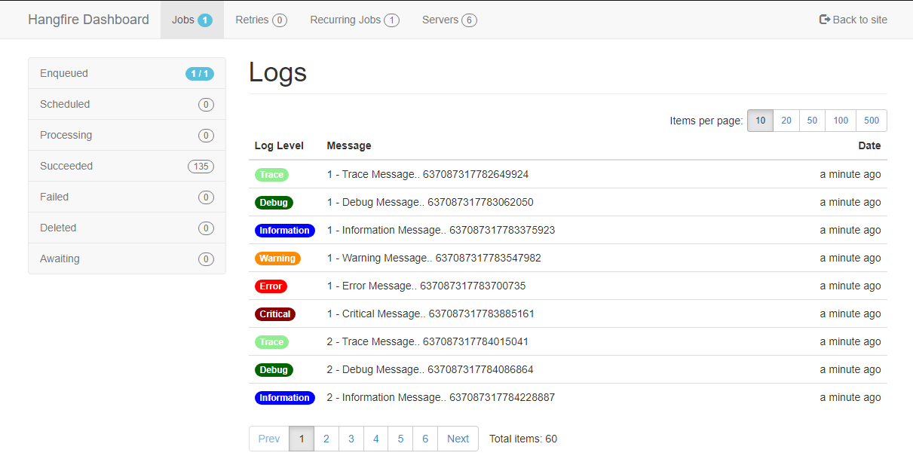
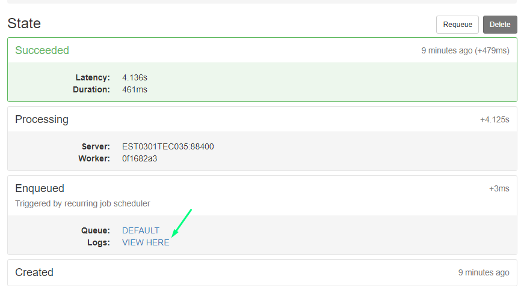

# Hangfire.JobsLogger
[](https://www.nuget.org/packages/Hangfire.JobsLogger)
[](https://github.com/raisedapp/Hangfire.JobsLogger/actions)
[](http://hangfire.io)
[](http://opensource.org/licenses/MIT)

## Overview
A Hangfire extension to store a log during job execution



## Build Status
`Platform` | `Master` | `Develop`
--- | --- | ---
**Windows** | [](https://circleci.com/gh/raisedapp/Hangfire.JobsLogger/tree/master) | [](https://circleci.com/gh/raisedapp/Hangfire.JobsLogger/tree/develop)
**Linux / Mac OS** | [](https://travis-ci.org/raisedapp/Hangfire.JobsLogger/) | [](https://travis-ci.org/raisedapp/Hangfire.JobsLogger/)

## Installation
Install a package from Nuget. 
```
Install-Package Hangfire.JobsLogger
```

## Usage

### DotNetCore

For service side:
```csharp
services.AddHangfire(config => config.UseSqlServerStorage(Configuration.GetConnectionString("HangfireConnection"))
                                                 .UseJobsLogger();
```

### NetFramework

For startup side:
```csharp
GlobalConfiguration.Configuration.UseSqlServerStorage("HangfireConnection").UseJobsLogger();
```

### Example

```csharp
RecurringJob.AddOrUpdate(() => taskExample.TaskMethod(null), Cron.Minutely);

public void TaskMethod(PerformContext context)
{
    context.LogTrace($"Trace Message.. {DateTime.UtcNow.Ticks}");
    context.LogDebug($"Debug Message.. {DateTime.UtcNow.Ticks}");
    context.LogInformation($"Information Message.. {DateTime.UtcNow.Ticks}");
    context.LogWarning($"Warning Message.. {DateTime.UtcNow.Ticks}");
    context.LogError($"Error Message.. {DateTime.UtcNow.Ticks}");
    context.LogCritical($"Critical Message.. {DateTime.UtcNow.Ticks}");
}
```

**Note**
Hangfire is responsible for injecting an instance of the PerformContext class.

The logs can be consulted in the detail of the logs on the enqueued state card:


#### Options

In the UseJobsLogger method you can use an instance of the Hangfire.JobsLogger.JobsLoggerOptions class to specify some options of this plugin.

Below is a description of them:

`Option` | `Description` | `Default Value`
--- | --- | ---
**LogLevel** | Set the log level to be stored in hangfire | **Microsoft.Extensions.Logging.LogLevel.Trace**
**LogTraceColor** |  Color that will be used to display log messages of this type | **System.Drawing.Color.LightGreen**
**LogDebugColor** |  Color that will be used to display log messages of this type | **System.Drawing.Color.DarkGreen**
**LogInformationColor** |  Color that will be used to display log messages of this type | **System.Drawing.Color.Blue**
**LogWarningColor** |  Color that will be used to display log messages of this type | **System.Drawing.Color.DarkOrange**
**LogErrorColor** |  Color that will be used to display log messages of this type | **System.Drawing.Color.Red**
**LogCriticalColor** |  Color that will be used to display log messages of this type | **System.Drawing.Color.DarkRed**

## Credits
 * Brayan Mota
 * Lucas Ferreras
 
## Thanks

This project would not have been possible, without the collaboration of the following projects:

 * [Hangfire.Console](https://github.com/pieceofsummer/Hangfire.Console)
 * [Hangfire.Hearbeat](https://github.com/ahydrax/Hangfire.Heartbeat)
 * [Hangfire.RecurringJobAdmin](https://github.com/bamotav/Hangfire.RecurringJobAdmin)
 * [Hangfire.LiteDb](https://github.com/codeyu/Hangfire.LiteDB)
 * [Hangfire.Tags](https://github.com/face-it/Hangfire.Tags)
 
## Donation
If this project help you reduce time to develop, you can give me a cup of coffee :) 

[](https://www.paypal.com/cgi-bin/webscr?cmd=_donations&business=RMLQM296TCM38&item_name=For+the+development+of+Hangfire.JobsLogger&currency_code=USD&source=url)

## License
This project is under MIT license. You can obtain the license copy [here](https://github.com/raisedapp/Hangfire.JobsLogger/blob/master/LICENSE).
